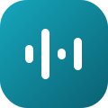
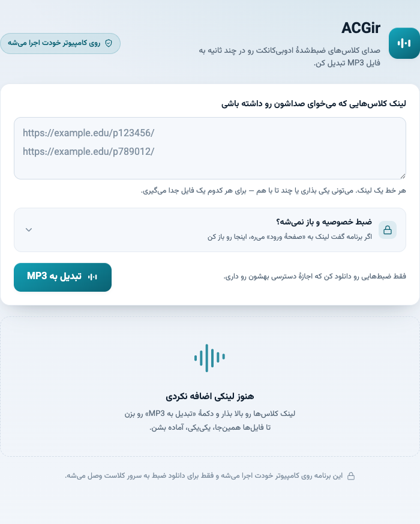
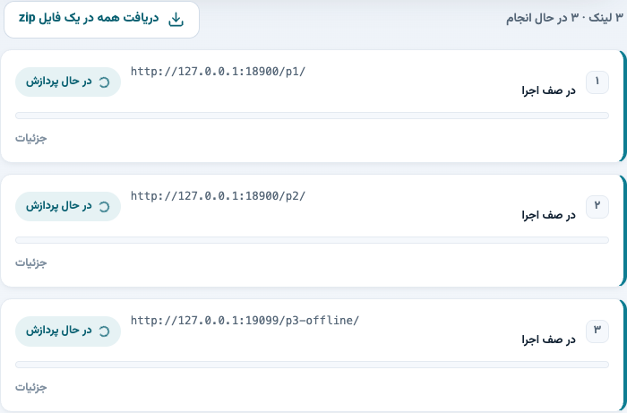
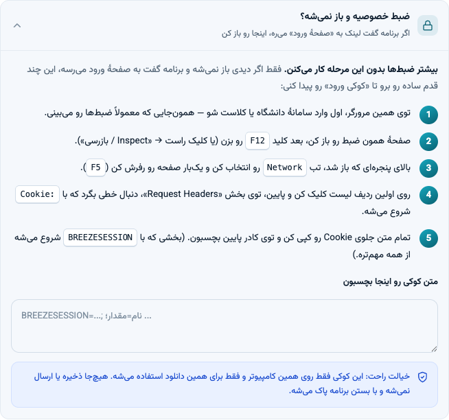
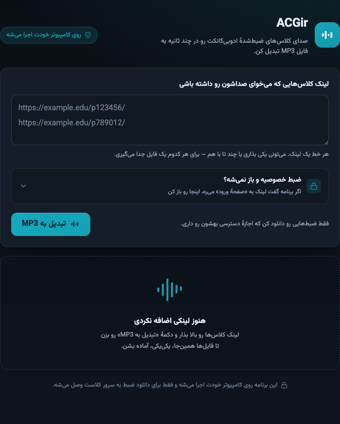

<div align="center">



# ACGir

**صدای کلاس‌های ضبط‌شدهٔ Adobe Connect را با یک کلیک به فایل MP3 تبدیل کن.**

A tiny, dependency-free local web app that turns Adobe Connect class recordings into MP3 audio — single or batch links, one click.

[](LICENSE)




</div>

---

## ✨ این برنامه چیه؟

**ACGir** یک ابزار سبک و محلی است که صدای ضبط‌های کلاس Adobe Connect را می‌گیرد و یک فایل **MP3** تمیز تحویل می‌دهد. هیچ نصبی لازم نیست، هیچ وابستگی خارجی ندارد، و **کاملاً روی کامپیوتر خودت** اجرا می‌شود؛ فقط برای دانلودِ خودِ ضبط به سرور کلاس وصل می‌شود.

برنامه یک وب‌سرور محلی روی `127.0.0.1` بالا می‌آورد و صفحه را خودکار در مرورگر باز می‌کند.

## 🎯 ویژگی‌ها

- 🎧 **تبدیل به MP3** از ضبط‌های Adobe Connect (مستقیم یا از داخل آرشیو `lecture.zip`).
- 🔗 **تک‌لینک یا چند لینک با هم** — هر خط یک لینک؛ برای هر کدام یک فایل جداگانه.
- 📦 **دریافت همه در یک ZIP** وقتی چند فایل آماده شد.
- 🖱️ **یک‌کلیک، بدون نصب** — یک فایل اجرایی برای ویندوز و مک.
- 🔒 **راهنمای قدم‌به‌قدمِ «کوکی ورود»** داخل خود برنامه، برای ضبط‌های خصوصی.
- 🌗 **رابط کاربری حرفه‌ای** با حالت روشن/تاریک خودکار و متن‌های فارسیِ ساده و دوستانه.
- 🧩 **بدون هیچ dependency** — فقط با کتابخانهٔ استاندارد Go نوشته شده.
- 🛡️ **محلی و امن** — لینک‌ها و فایل‌ها جایی ذخیره یا ارسال نمی‌شوند.

## 📸 تصاویر

| چند لینک با هم | راهنمای کوکی ورود | حالت تاریک |
|:---:|:---:|:---:|
|  |  |  |

## 🚀 اجرا (با یک کلیک)

نسخهٔ آماده را از بخش [**Releases**](../../releases) دانلود کن، یا از روی سورس بساز (پایین‌تر).

- **🪟 Windows:** روی `Start-ACGir-Windows.bat` (یا مستقیماً `ACGir-windows-amd64.exe`) دوبار کلیک کن.
- **🍎 macOS:** روی `Start-ACGir-macOS.command` دوبار کلیک کن (خودش نسخهٔ Apple Silicon یا Intel را اجرا می‌کند).

برنامه خودکار در مرورگر باز می‌شود. برای بستن، همان پنجره‌ای را که باز شده ببند.

> **ویندوز:** اگر هشدار «Windows protected your PC» دیدی، روی **More info → Run anyway** بزن (چون فایل امضای رسمی ندارد، طبیعی است).
>
> **مک:** اگر Gatekeeper اجرا را بست، یک‌بار اجرا کن: `xattr -dr com.apple.quarantine ACGir-macos-*` — لانچر `.command` این کار را خودش هم انجام می‌دهد.

## 📖 استفاده

۱. لینک کلاس‌ها را در کادر بگذار — **هر خط یک لینک**. می‌توانی یکی بگذاری یا چند تا با هم.
۲. دکمهٔ **«تبدیل به MP3»** را بزن.
۳. برای هر لینک یک کارت با نوار پیشرفت ساخته می‌شود؛ بعد از آماده شدن، فایل را از همان کارت بگیر.
۴. اگر چند فایل آماده شد، با **«دریافت همه در یک فایل zip»** همه را یک‌جا بگیر.

برای پرهیز از فشار روی سرور، هم‌زمان حداکثر **سه لینک** پردازش می‌شود و بقیه در صف می‌مانند.

لینک‌های واسط Moodle مثل `mod/adobeconnect/joinrecording.php?...` هم پشتیبانی می‌شوند؛ برنامه query لینک را حفظ می‌کند، مسیر `output/lecture.zip` را امتحان می‌کند، و در صورت لزوم redirect یا لینک واقعی ضبط را از HTML صفحه پیدا می‌کند.

## 🔐 ضبط‌های خصوصی (کوکی ورود)

اگر ضبط بدون ورود باز نمی‌شود (برنامه می‌گوید لینک به «صفحهٔ ورود» رسید)، در خود برنامه بخش **«ضبط خصوصیه و باز نمی‌شه؟»** را باز کن. یک راهنمای ساده و قدم‌به‌قدم آنجاست:

1. در همان مرورگر وارد سامانهٔ دانشگاه/کلاست شو.
2. صفحهٔ ضبط را باز کن و `F12` را بزن (یا کلیک راست → Inspect).
3. تب **Network** را بزن و صفحه را رفرش کن.
4. روی اولین ردیف کلیک کن و خطی که با `Cookie:` شروع می‌شود را پیدا کن.
5. کل متن جلوی Cookie را کپی و در کادر برنامه بچسبان (بخشی که با `BREEZESESSION` شروع می‌شود مهم‌ترین است).

این کوکی فقط روی همین کامپیوتر و برای همین دانلود استفاده می‌شود؛ جایی ذخیره یا ارسال نمی‌شود و با بستن برنامه پاک می‌شود. ACGir هیچ ورود یا دور زدن دسترسی‌ای انجام نمی‌دهد و فقط از نشستی استفاده می‌کند که خودت مجاز به استفاده از آن هستی.

## 🛠️ ساخت از روی سورس

نیاز: [Go](https://go.dev/dl/) نسخهٔ ۱.۲۳ یا بالاتر.

```bash
# ساخت هر سه نسخه (مک arm64/amd64 و ویندوز) + لانچرهای یک‌کلیکی در dist/
./build.sh
```

یا دستی:

```bash
go test ./...
CGO_ENABLED=0 GOOS=darwin  GOARCH=arm64 go build -trimpath -ldflags='-s -w' -o dist/ACGir-macos-arm64 .
CGO_ENABLED=0 GOOS=darwin  GOARCH=amd64 go build -trimpath -ldflags='-s -w' -o dist/ACGir-macos-amd64 .
CGO_ENABLED=0 GOOS=windows GOARCH=amd64 go build -trimpath -ldflags='-s -w' -o dist/ACGir-windows-amd64.exe .
```

برای اجرای محلی هنگام توسعه:

```bash
go run .            # سرور بالا می‌آید و مرورگر باز می‌شود
go run . -no-browser -addr 127.0.0.1:8080
```

## ⚙️ چطور کار می‌کند؟

1. **کشف (Discovery):** از روی لینک، مسیرهای احتمالی آرشیو (`output/lecture.zip`) و مسیر واقعی ضبط را پیدا می‌کند؛ در صورت نیاز redirectها و HTML صفحه و پاسخ `mode=xml` را هم می‌خواند.
2. **دریافت:** اول آرشیو ZIP خروجی را امتحان می‌کند؛ اگر نبود، فایل‌های صوتی (`cameraVoip*.flv`، `telephony*`، …) را از روی `indexstream.xml`/`mainstream.xml` دانلود می‌کند.
3. **استخراج صدا:** صدای MP3 را مستقیماً از فایل‌های FLV بیرون می‌کشد و در صورت چند تکه بودن، به هم می‌چسباند.
4. اگر `ffmpeg` کنار فایل اجرایی یا روی `PATH` باشد، بزرگ‌ترین `.flv`/`.mp4` را با FFmpeg به MP3 تبدیل می‌کند (مسیر باکیفیت‌تر).

## 📌 محدودیت مهم

این نسخه هیچ dependency خارجی مثل FFmpeg ندارد، بنابراین **بدون FFmpeg** فقط این حالت‌ها را به MP3 تبدیل می‌کند:

- فایل MP3 مستقیم داخل خروجی Adobe Connect
- صدای MP3 داخل فایل‌های FLV مثل `cameraVoip*.flv`

اگر `ffmpeg` در دسترس باشد، حالت‌های بیشتری (FLV/MP4 با کدک‌های دیگر) هم پشتیبانی می‌شود. بدون FFmpeg، اگر سرور صدا را با **AAC / Speex / Nellymoser** ذخیره کرده باشد، برنامه خطای واضح می‌دهد؛ تبدیل آن کدک‌ها بدون encoder/decoder خارجی ممکن نیست.

## 🗂️ ساختار پروژه

```
ACGir/
├── main.go         # کل برنامه: وب‌سرور، کشف لینک، دانلود، استخراج MP3، و رابط کاربری
├── main_test.go    # تست‌ها
├── build.sh        # ساخت همهٔ نسخه‌ها + لانچرها در dist/
├── docs/           # لوگو و اسکرین‌شات‌ها
└── README.md
```

## 🧭 اخلاق استفاده

ACGir ابزار دور زدن دسترسی نیست. فقط ضبط‌هایی را دانلود کن که **اجازهٔ دسترسی و استفاده از آن‌ها را داری**.

## 📄 مجوز

تحت مجوز [MIT](LICENSE) منتشر شده است. ساخته‌شده با ❤️ برای دانشجوها.

## 📚 منابع رفتار Adobe Connect

- [پیدا کردن ضبط با `mode=xml`](https://helpx.adobe.com/adobe-connect/kb/locate-connect-recording-using-connect-recording.html)
- [ساخت URL دانلود zip خروجی](https://helpx.adobe.com/lv/adobe-connect/webservices/getting-started-connect-web-services.html)
- [مسیرهای `output/indexstream.xml` و `output/mainstream.xml`](https://helpx.adobe.com/adobe-connect/kb/troubleshoot-recording-issues.html)
